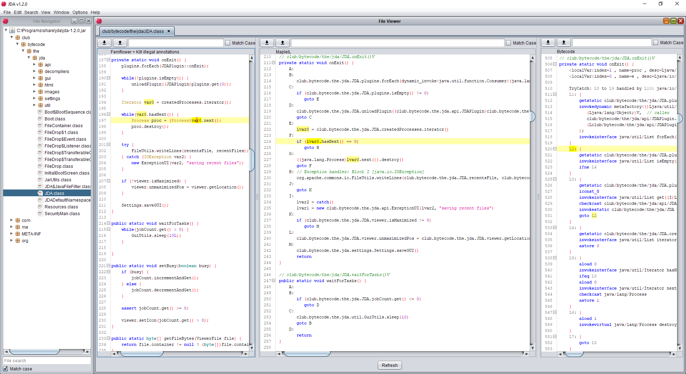

# JDA - The Java Disassembler

Java Disassembler (JDA) is a fork of Bytecode Viewer (BCV) that adds advanced code analysis features. The basic principles of BCV are maintained; however, many aspects are different.

## Motivation
The main reason JDA was forked was that BCV was becoming too large and cumbersome, with many redundant, unused, or
useless features. The issue with removing them is that there could be many BCV users that relied on such features.
Because of this, it is more appropriate to fork JDA as a separate project. Additionally, BCV's development has
stagnated, and the last official build is from July 2015. It has since grown increasingly difficult and arcane to
compile BCV from source, and full jars often range into 20Mb in size. It has become necessary to fork BCV in order
to make large-scale changes.

In addition to the growing power and complexity of commercial obfuscation programs for Java, it has become increasingly
necessary to develop improved reverse engineering and static analysis tools. For this reason, JDA has been developed
in order to provide professional-quality static analysis tools for JVM-based languages.

## Scope
With that in mind, JDA's goal is to be a light-weight yet powerful Java static disassembler. BCV suffered from a
multitude of issues, but a large one was that it tried to be a dynamic reverse engineering tool (debugger) as well
as a static tool (disassembler) at the same time, only succeeding partially in the latter. JDA's role is to provide
a platform and interface for the core features such as analysis and disassembly. Additionally, many useless
or irrelevant features have been removed. JDA's scope as a program currently is to be a platform for reverse engineering
tools to be built on top of.

In the future, JDA will have powerful static analysis tools, such as control and data flow analysis, code contraction
(copy and constant propagation), whole binary cross referencing (xrefs), and an IR engine. However, these standard
core utilities will be distributed separately as the [MapleIR](https://github.com/LLVM-but-worse/maple-ir) plugin.

## Features
 - Ergonomic design for low-level bytecode reversing
 - [Data-flow analysis with copy and constant propagation](docs/propagation-analysis.png) (provided by MapleIR)
 - Support for a variety of decompilers
 - Cross-reference bytecode, decompilation, and IR.

More to come in the future.

## Maple-IR Plugin

To install the plugin put the plugin jar in `~/.jda/plugins` (or equivalently, `%USERPROFILE%\.jda\plugins` on Windows), then restart.

## Compiling
See [COMPILING.md](./docs/COMPILING.md) for compilation instructions.

## Credits
 - Logo (icosahedron) image by [Brayden Gregerson](http://braydengregerson.com), used with permission
 - [Bytecode Viewer](https://github.com/Konloch/bytecode-viewer) by [Konloch](https://github.com/Konloch)
 - Disassembler by [Bibl](https://github.com/TheBiblMan)
